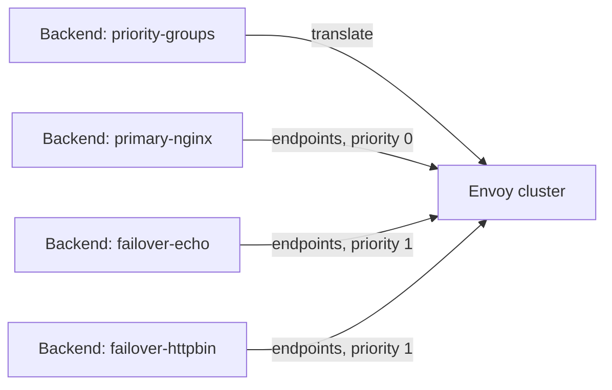
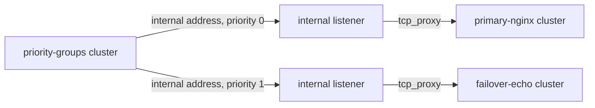

# EP-13643: Backend Priority Groups

- Issue: [#13643](https://github.com/kgateway-dev/kgateway/issues/13643)

## Background

kgateway's `Backend` CRD supports several backend types (Static, AWS, DynamicForwardProxy, GCP), but has no way to express failover between backends: an ordered set of backends where traffic is only sent to a lower-priority backend when the higher-priority backends are unhealthy.

Envoy natively supports this via [priority levels](https://www.envoyproxy.io/docs/envoy/latest/intro/arch_overview/upstream/load_balancing/priority) in a cluster's `ClusterLoadAssignment`: each `LocalityLbEndpoints` entry carries a `priority`, and Envoy sends traffic to the lowest priority level that has enough healthy endpoints, spilling over to the next level as health degrades (controlled by the overprovisioning factor, default 140%).

This EP adds a `priorityGroups` field to the `Backend` CRD that maps an ordered list of backend groups onto Envoy priority levels.

## Motivation

Users want active/passive failover between distinct backends — for example, a primary in-cluster service with an external DNS-addressed fallback — driven by active health checks, with no traffic disruption during failover and automatic recovery when the primary returns.

## Goals

- Express an ordered list of failover groups on a `Backend`, where each group references one or more existing `Backend` resources.
- Translate the groups into a single Envoy cluster whose load assignment uses one priority level per group, with the priority matching the group's position in the list (first group is priority 0, the highest).
- Load balance across all endpoints of all members within a group (members of a group share a priority level).
- Drive failover with active health checks attached via `BackendConfigPolicy`, and automatically recover to the higher-priority group when it becomes healthy again.

## Non-Goals

- Supporting non-static backends (AWS, GCP, DynamicForwardProxy, or nested priority groups) as group members. See [Why only static backends](#why-only-static-backends).
- Per-backend or per-group load balancing weights. The current translation is endpoint-fair within a group; weights could be added later (see [Alternatives](#alternatives)).
- Cross-namespace backend references. Group members must be in the same namespace as the priority groups `Backend`.
- Per-group health check or outlier detection configuration. Health checking applies to the merged cluster as a whole.

## Implementation Details

### Configuration

A new `priorityGroups` field on `BackendSpec`, mutually exclusive with the other backend types (enforced by CEL `ExactlyOneOf`):

```yaml
apiVersion: gateway.kgateway.dev/v1alpha1
kind: Backend
metadata:
  name: priority-groups
spec:
  priorityGroups:
    - backendRefs:            # group 0: primary, priority 0
        - name: primary-nginx
    - backendRefs:            # group 1: failover, priority 1
        - name: failover-echo
        - name: failover-httpbin
```

Each `backendRefs` entry is a `corev1.LocalObjectReference` to a `Backend` in the same namespace. Referenced backends must be static backends; anything else is a translation error reported on the priority groups `Backend`'s status.

### Plugin

The backend plugin (`pkg/kgateway/extensions2/plugins/backend/`) gains a `PriorityGroupsIr` (in `priority_groups.go`), built once per `Backend` change following the standard policy-to-IR pattern:

1. For each group index `gi`, create one `LocalityLbEndpoints` with `priority: gi`.
2. For each `backendRef` in the group, fetch the referenced `Backend` from the KRT collection (registering a dependency, so changes to referenced backends retrigger translation), reuse the existing static translation (`buildStaticIr`), and append its endpoints to the group's locality.
3. If any referenced host is a DNS name rather than an IP, mark the cluster as requiring the `envoy.clusters.dns` custom cluster type, mirroring the static backend behavior.

The resulting cluster contains the referenced backends' endpoints directly:

```yaml
loadAssignment:
  endpoints:
    - priority: 0
      lbEndpoints:
        - endpoint: { address: nginx.nginx-shared.svc:8080 }
    - priority: 1
      lbEndpoints:
        - endpoint: { address: http-echo.http-echo.svc:3000 }
        - endpoint: { address: httpbin.default.svc:8000 }
```



Errors (missing reference, non-static reference) are collected per-ref rather than aborting translation, and surface on the `Backend` status.

### Failover behavior

Since the referenced backends' endpoints are merged into the cluster's own load assignment, an active health check configured on the priority groups `Backend` via `BackendConfigPolicy` probes the real endpoints directly. When the healthy fraction of priority 0 drops below `100 / overprovisioning_factor` (about 71% at the default 140%), Envoy shifts the shortfall to priority 1, and shifts it back when priority 0 recovers. No kgateway control plane involvement is needed during failover; it is entirely an Envoy data plane behavior.

### Why only static backends

An `LbEndpoint` in a `ClusterLoadAssignment` requires a concrete network endpoint — an address and port. Only static backends reduce to that. The other backend types do not:

- **AWS (Lambda)** requires request signing and transformation via cluster-level HTTP filters and a specific transport socket, none of which can be expressed on an endpoint inside another cluster.
- **GCP** requires the `gcp_authn` HTTP filter and its metadata cluster.
- **DynamicForwardProxy** has no endpoints at all; hosts are discovered per-request.
- **Nested priority groups** would require recursive flattening and is rejected for simplicity (this also rules out self-references).

Supporting these types requires an indirection that preserves their per-cluster configuration — see the internal listener alternative below.

### Test Plan

- Unit tests (`priority_groups_test.go`): priority matches group order; group members' endpoints merge into one locality; DNS hostnames switch the cluster to the DNS cluster type; missing and non-static references produce errors.
- E2E test (`test/e2e/features/backends`, `TestPriorityGroupsFailover`): with an active health check attached, kill the priority 0 service and assert zero-downtime failover to both group 1 members, then restore it and assert traffic drains back to priority 0.

## Alternatives

### Internal listener bridging

Instead of merging endpoints, give each referenced `Backend` its normal standalone cluster, and populate the priority groups cluster with `envoy_internal_address` endpoints pointing at generated [internal listeners](https://www.envoyproxy.io/docs/envoy/latest/configuration/other_features/internal_listener), each of which `tcp_proxy`s to the referenced backend's cluster:



This is strictly more general: any backend type (Lambda, GCP, DFP) works as a group member, because each referenced backend keeps its own cluster with its own filters, transport sockets, and per-cluster configuration.

It was prototyped and rejected for now because **active health checks fail through internal listeners**: health check probes from the priority groups cluster to the internal listener endpoints do not behave correctly, which breaks the core failover mechanism this feature depends on. The root cause needs further investigation before this approach can be revisited. It also emits more resources per priority groups backend (one cluster and one internal listener per referenced backend, plus the parent cluster) and makes stats and debugging harder to follow.

If non-static group members become a requirement, this alternative is the natural path once the health check issue is understood.

### One locality per referenced backend

Instead of merging each group's members into a single `LocalityLbEndpoints`, each referenced backend could become its own locality (with the backend name in `subZone`), with group members sharing a priority. Traffic distribution is identical under the default load balancer, and per-locality stats would make debugging easier; it would also open the door to per-backend weights via `locality_weighted_lb_config`. It was rejected because the locality fields would carry fabricated values, which can interact badly with real locality features (zone-aware routing, locality-weighted load balancing configured elsewhere), and the current API has no weights to take advantage of it. Switching later is an xDS-only change with no API impact.

## Open Questions

- Why do active health checks fail through internal listener endpoints? Resolving this unblocks non-static backends as group members.
- Should group members eventually support load balancing weights (per backend or per endpoint)? This likely forces the one-locality-per-backend translation.
