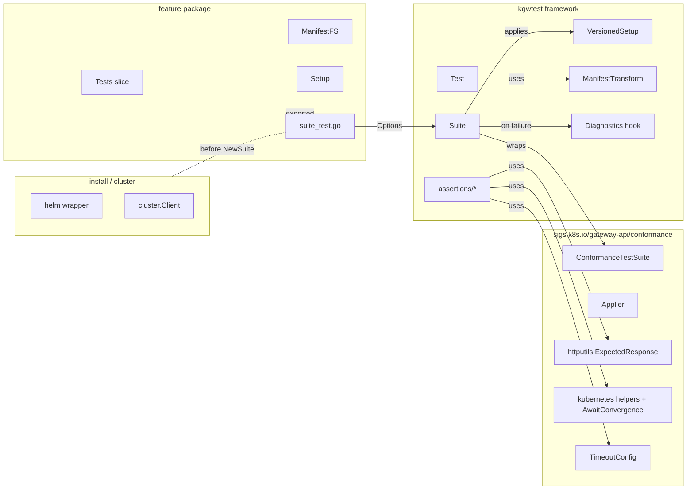

# kgateway conformance-e2e: architecture overview

A condensed companion to [DESIGN.md](DESIGN.md). Covers the layout, the responsibilities of each piece, how the framework relates to upstream gateway-api conformance, and the deltas worth knowing when migrating tests from `test/e2e/`.

## Goal

Wrap upstream `sigs.k8s.io/gateway-api/conformance` so kgateway-specific tests can reuse the upstream machinery (suite, applier, HTTP matchers, status helpers) without forking it, while adding the few things upstream doesn't cover: kgateway CRD assertions, version/channel gating, labels, manifest transforms, install, and failure diagnostics.

The framework lives at `test/conformance-e2e/`, parallel to (and isolated from) the legacy `test/e2e/`.

## Directory layout

```text
test/conformance-e2e/
├── kgwtest/                       # framework, imported as .../test/conformance-e2e/kgwtest
│   ├── test.go                    # kgwtest.Test, TestContext
│   ├── suite.go                   # kgwtest.Suite, Options, NewSuite, Run
│   ├── version.go                 # GW API version + channel detection / gating
│   ├── setup.go                   # VersionedSetup, Setup selection
│   ├── namespace.go               # per-test namespace creation
│   ├── diagnostics.go             # on-failure dump hook
│   ├── main.go                    # kgwtest.Main / MainWithDefaults TestMain helpers
│   ├── transforms.go              # ManifestTransform implementations
│   ├── install/                   # helm wrapper (CRDs + Core)
│   ├── cluster/                   # kubectl ops (Exec, PortForward, RestartDeployment)
│   └── assertions/
│       ├── gateway/, httproute/, policy/   # kgateway CRD status
│       ├── envoy/                          # Envoy admin / config-dump
│       ├── metrics/                        # controller metrics
│       ├── k8s/                            # generic Conditions / existence / replicas
│       └── curl/                           # in-cluster curl
└── <feature>/                     # one Go package per feature (basic-routing, cors, ...)
    ├── <feature>.go               # importable: ManifestFS, TestNamespace, Setup, Tests slice
    ├── <scenario>.go              # importable: one exported kgwtest.Test value
    ├── suite_test.go              # entry point: TestX(t) constructs Suite, calls Run
    └── testdata/*.yaml            # applied verbatim — no templating
```

## Responsibilities at a glance

| Component | Responsibility | Not its job |
|---|---|---|
| `kgwtest.Test` | Declarative scenario: manifests, labels, version bounds, namespace mode, body | Knowing about the cluster or running anything |
| `kgwtest.Suite` | Wrap `confsuite.ConformanceTestSuite`, apply `VersionedSetup` once, run scenarios | Installing kgateway, mutating manifests |
| `kgwtest.Options` | Inputs to `NewSuite`: gateway class, manifest filesystems, schemes, filters | Per-scenario data |
| `VersionedSetup` | Pick the right suite-level fixture for the cluster's GW API version + channel | Per-test fixtures |
| `ManifestTransform` | Last-resort byte-level rewrite of manifests for cross-version compat | General templating |
| `kgwtest/install` | Helm install/uninstall of CRDs + core charts | Anything beyond running helm |
| `kgwtest/cluster` | Kubectl-equivalent ops (exec, port-forward, restart, logs) | Assertions |
| `kgwtest/assertions/*` | Wait for state via matcher structs; one function per shape-of-wait | Holding state, owning a client |
| Feature package (e.g. `basic-routing/`) | Export `Tests`, `ManifestFS`, `TestNamespace`, `Setup` so the suite — or downstream — can compose them | Owning install or controller setup |
| `suite_test.go` (entry point) | Construct `kgwtest.Suite`, call `Run(t, package.Tests)` | Defining scenarios |

## High-level architecture



The Suite is **a value, not a singleton**. Every test binary constructs its own. Feature packages export the pieces a Suite needs, never a Suite itself.

## What we reuse from upstream conformance

These are imported as-is. The framework adds nothing parallel.

- `confsuite.ConformanceTestSuite` -> wrapped by `kgwtest.Suite`, kept as `Suite.Conformance`.
- `confsuite.ConformanceTest` -> `Run(t, suite)` is what executes each scenario; `kgwtest.Test` translates into one of these.
- `Applier.MustApplyWithCleanup` -> manifest application + `t.Cleanup` teardown.
- `httputils.ExpectedResponse` and `MakeRequestAndExpectEventuallyConsistentResponse` -> all HTTP assertions go through this.
- `kubernetes.GatewayAndHTTPRoutesMustBeAccepted`, `HTTPRouteMustHaveResolvedRefsConditionsTrue`, etc. -> upstream status helpers used directly when they fit.
- `wait.PollUntilContextTimeout` + `http.AwaitConvergence` -> the only polling primitives. No Gomega `Eventually`, no custom retry loops.
- `config.TimeoutConfig` -> threaded into every kgateway assertion.
- CRD-annotation-based version + channel detection -> mirrored in `version.go`.

## What kgwtest adds on top

These exist because upstream doesn't cover them, not for stylistic preference.

- **`kgwtest.Test`**: flat struct with `Labels`, `MinGwApiVersion` / `MaxGwApiVersion`, `RequireChannel`, `ManifestTransforms`, `Namespace` (opt-in isolation), `Slow` / `Provisional` flags. Translates 1:1 into a `confsuite.ConformanceTest`.
- **`VersionedSetup`**: pick suite-level manifests by `Channel` + semver range, fall back to `Default`. Ports the existing `test/e2e/tests/base/base_suite.go` semantics into the new world.
- **`Options.Schemes`**: extension point for non-default API groups (`autoscalingv2`, `policyv1`, kgateway CRDs) so the conformance suite's `client.Client` can decode them.
- **Labels + filters**: `RunLabels` / `SkipLabels` (plus env vars) on top of upstream's name-only filtering.
- **`ManifestTransform`**: byte-level rewrite for cross-version compat (e.g., `ListenerSet` -> `XListenerSet` on older experimental channels). The default for any author is to add nothing.
- **kgateway-specific assertions**: matcher-struct API (`ConditionMatch{Type, Status, Reason, ReasonIn, MessageContains}`, `ClusterMatch`, `LogLevelMatch`); zero-value field == "don't check". One function per shape-of-wait, never one function per field.
- **`kgwtest/install`**: helm wrapper for CRDs + core. Suite is install-agnostic; `kgwtest.Main` is an opt-in TestMain helper that calls install before `m.Run()`.
- **`kgwtest/cluster`**: exec, port-forward, deployment restart — replaces the legacy `TestInstallation.Actions.Kubectl()`.
- **Diagnostics hook**: on failure, dump controller logs, Envoy config-dump, and per-test-namespace YAMLs to `$ARTIFACTS_DIR/<ShortName>/`.

## How feature packages are shaped

Each feature package has two kinds of files:

- **Importable** (no `_test` suffix, build-tagged `e2e`). Hold `ManifestFS`, `TestNamespace`, `Setup`, the `Tests` slice (in `<feature>.go`), and one exported `kgwtest.Test` per scenario file. Exported so anyone can compose them — internal binaries and downstream forks alike.
- **Entry point** (`suite_test.go`). The only `_test.go` file. Constructs `kgwtest.Suite`, calls `Suite.Run(t, package.Tests)`. Holds nothing else.

**Aggregation is explicit, not `init()`-based.** Each scenario file declares an exported `var GatewayWithRoute = kgwtest.Test{...}`. The package's main file lists them in one canonical slice:

```go
// basic_routing.go
var Tests = []kgwtest.Test{
    GatewayWithRoute,
    MultipleListeners,
}
```

Adding a scenario means a new file with an exported `var`, plus one line in `Tests`. The slice is statically auditable, scenarios are addressable by name (`basicrouting.GatewayWithRoute`), and there is no import-order behavior to reason about.

Three composition patterns, in order of preference:

1. **Single feature suite** -> the entry point pulls one package's `Tests` and `Setup`. Default.
2. **Separate sub-suites in one binary** -> `t.Run("feature-a", ...)` per package. Use when setups differ meaningfully.
3. **Filter + extend (downstream)** -> take upstream `Tests`, drop scenarios by `ShortName`, append local ones, point `Options.ManifestFS` at both filesystems.

## Migration: changes to make when porting `test/e2e/features/*`

A migrated suite is not a 1:1 port of the legacy code. Things to change deliberately:

### Shared gateways and clean namespaces

The legacy framework leans on `BaseTestingSuite` to spin per-test gateways and resources. The new model defaults to **shared fixtures, opt-in isolation** — same shape upstream conformance uses (`gateway-conformance-infra` namespace, fixed gateways).

- Each feature package declares one or more namespaces in `testdata/_suite.yaml` (applied via `Setup.Manifests`). Use a stable, descriptive name like `kgw-e2e-<feature>` so manifests are kubectl-applyable in isolation.
- Resources for parallel scenarios in the same namespace get **scenario-prefixed names** (`gateway-with-route-svc`, `multiple-listeners-svc`). Collisions become PR-time review issues, not flakes.
- A scenario that genuinely needs isolation (watches deletion, installs cluster-scoped resources) sets `Test.Namespace = "kgw-e2e-<unique>"`. The framework creates and tears down. Manifests hardcode the same name.
- `Suite.Run` validates that no two `Test`s share a non-empty `Namespace`.

Practical rule: **default to a shared gateway**, fall back to per-test only when the test mutates gateway-shaped state.

### Manifests are verbatim YAML

- Hardcode `gatewayClassName: kgateway` (or `kgateway-waypoint`, etc.) — `Options.GatewayClassName` does *not* mutate manifests; it only tells the upstream suite which class to discover.
- Hardcode namespaces.
- No Go templates, no envsubst. If a value genuinely has to vary across versions, that's what `ManifestTransform` is for.
- A reader should be able to `kubectl apply -f testdata/<file>.yaml` against a running cluster and reproduce the test's resources.

### Translate the legacy primitives

| Legacy (`test/e2e/`) | New (`test/conformance-e2e/`) |
|---|---|
| `TestInstallation` god object | Decomposed into `Suite`, `cluster.Client`, `install.*` |
| `TestInstallation.Actions.Kubectl()` | `cluster.Client.Exec` / `Patch` / `RestartDeployment` |
| `TestInstallation.InstallKgatewayFromLocalChart` | `install.InstallCore` (called from `TestMain` or before `NewSuite`) |
| `BaseTestingSuite` + `BeforeTest` / `AfterTest` | `kgwtest.Test` declarative fields + `VersionedSetup` |
| Gomega `Eventually` | `wait.PollUntilContextTimeout` (status), `http.AwaitConvergence` (HTTP) |
| Per-suite custom assertions | `kgwtest/assertions/*` matcher structs |
| Inline `t.Cleanup` for kubectl-applied YAML | `Applier.MustApplyWithCleanup` (handled by Suite) |

### Suite-level vs per-test setup

- `VersionedSetup` runs **once per suite**, not per scenario. Use it for the gateway, shared backend service, and any deployments scenarios will reuse.
- Per-scenario manifests in `Test.Manifests` apply right before the scenario runs; upstream registers their cleanup against the scenario's `t`.
- Don't put per-scenario state into `VersionedSetup` — that creates implicit ordering between scenarios.

### Version + channel gating during port

Many legacy tests have `if gwapi.Version >= "1.5"` checks scattered through the body. Lift those to declarative fields:

- `Test.MinGwApiVersion = "1.5.0"` skips with a clear message instead of a runtime branch.
- `Test.RequireChannel = ChannelExperimental` for experimental-only features.
- For experimental-vs-standard CRD shape differences, prefer a `ManifestTransform` over duplicate manifests.

### Diagnostics

Stop hand-rolling `kubectl logs` calls in `AfterTest`. The Suite's failure-dump hook is the single place that captures controller logs, Envoy config-dump, and resource YAMLs. If a test needs something not in the default dump, extend the hook — don't sprinkle one-off logging in test bodies.

### CI

A migrated suite gets a job in [.github/workflows/e2e.yaml](.github/workflows/e2e.yaml) that:

1. Builds and loads images (existing `make kind-build-and-load`).
2. Installs CRDs + core (either via `make install-kgateway-for-conformance` or `kgwtest.Main` inside the binary — pick one, not both).
3. Runs `go test -tags e2e ./test/conformance-e2e/<feature>/...`.

The legacy `make e2e-test` target stays alive until every feature is migrated; the two frameworks share no code.

## Pointers

- Full design and rationale: [DESIGN.md](DESIGN.md)
- Plugin SDK and overall translation pipeline: `/devel/architecture/overview.md`
- Upstream conformance: `sigs.k8s.io/gateway-api/conformance/utils/{suite,kubernetes,http}`
- Legacy framework being replaced: [test/e2e/](../e2e/)
